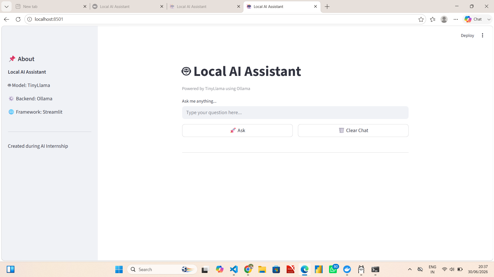
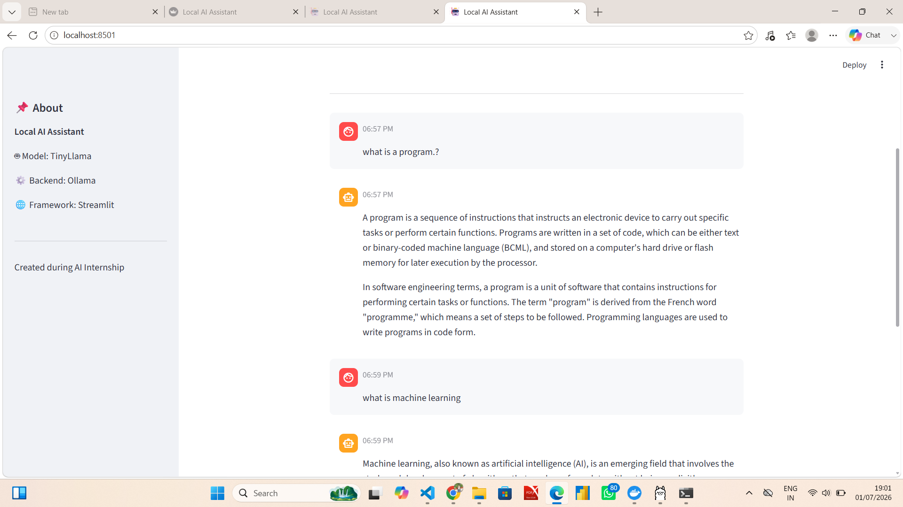
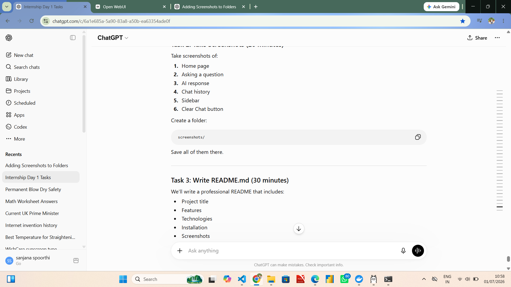
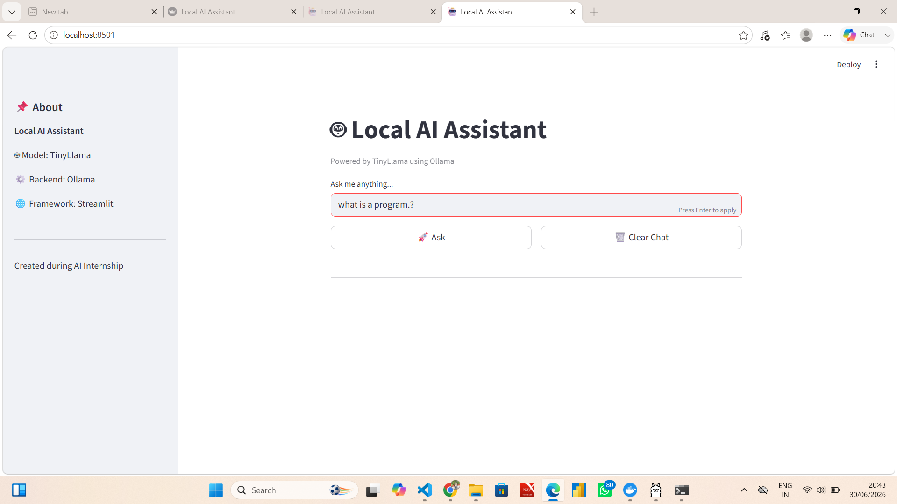
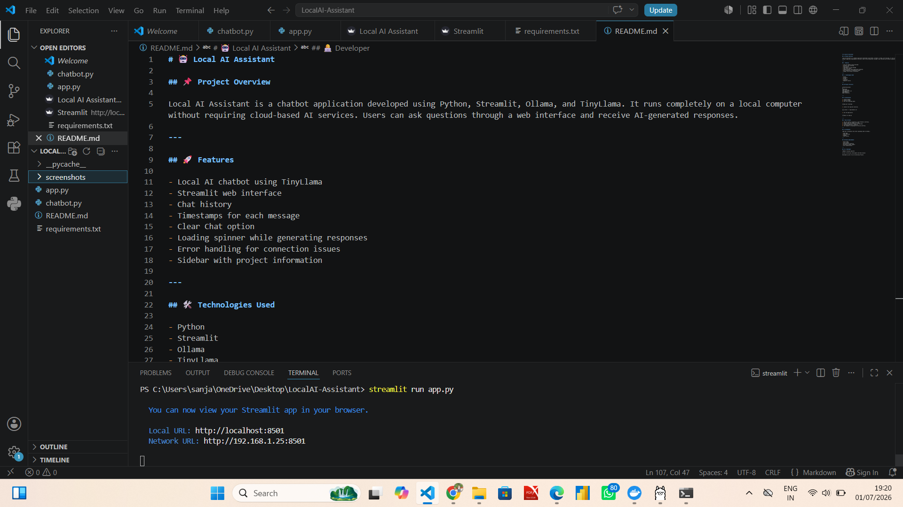

# 🤖 Local AI Assistant

## 📌 Project Overview

Local AI Assistant is a chatbot application developed using Python, Streamlit, Ollama, and TinyLlama. It runs completely on a local computer without requiring cloud-based AI services. Users can ask questions through a web interface and receive AI-generated responses.

---

## 🚀 Features

- Local AI chatbot using TinyLlama
- Streamlit web interface
- Chat history
- Timestamps for each message
- Clear Chat option
- Loading spinner while generating responses
- Error handling for connection issues
- Sidebar with project information

---

## 🛠️ Technologies Used

- Python
- Streamlit
- Ollama
- TinyLlama
- Requests Library

---

## 📂 Project Structure

```
LocalAI-Assistant/
│
├── app.py
├── chatbot.py
├── requirements.txt
├── README.md
└── screenshots/
```

---

## ⚙️ Installation

1. Install Python.
2. Install Ollama.
3. Pull the TinyLlama model.

```
ollama pull tinyllama
```

4. Install the required libraries.

```
pip install -r requirements.txt
```

5. Run the application.

```
streamlit run app.py
```

---

## 💡 How It Works

1. The user enters a question in the Streamlit interface.
2. Python sends the prompt to Ollama.
3. Ollama forwards the request to TinyLlama.
4. TinyLlama generates a response.
5. The response is displayed in the web interface.

---

## 📸 Screenshots

(Add your screenshots here after uploading them to GitHub.)

- Home Page
- Chat Interface
- Sidebar
- Chat History

---

## 📈 Future Improvements

- Voice input
- Voice output
- PDF question answering
- Multiple AI model support
- User authentication

---

## 👩‍💻 Developer

**Name:** Sanjana Spoorthi

B.Tech – Artificial Intelligence and Data Science

Developed as part of an AI Internship Project.
## 📸 Screenshots

### Home


### Chat


### Response


### Clear Chat


### Timestamps


### VS Code Project

